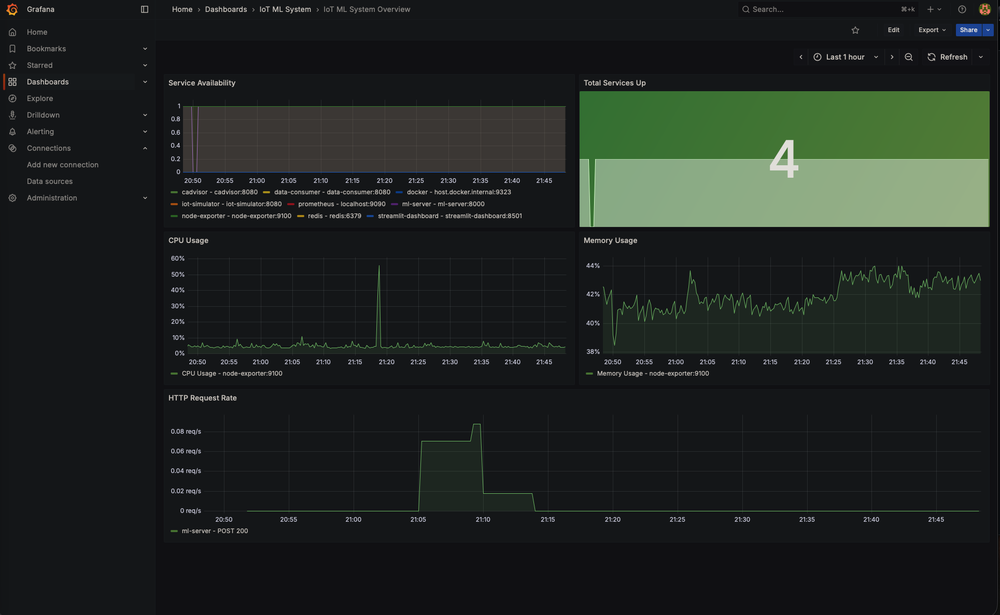
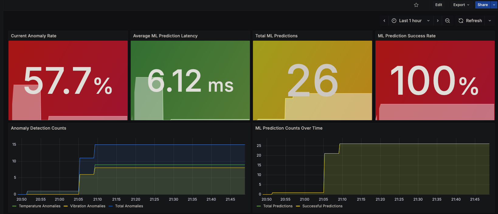

# IoT Anomaly Detection System with Machine Learning

A comprehensive IoT data pipeline with real-time anomaly detection using machine learning, built on Google Cloud Platform.

## 🏗️ Architecture Overview

```
IoT Devices → Pub/Sub → Data Consumer → BigQuery → ML Training
                                    ↓
Streamlit Dashboard ← ML Server ← Trained Models
```

## 🚀 Features

- **Real-time IoT Data Simulation**: 50+ virtual sensors generating temperature and vibration data
- **Scalable Data Pipeline**: Google Cloud Pub/Sub → BigQuery data ingestion
- **Machine Learning**: Isolation Forest models for anomaly detection
- **Real-time Predictions**: REST API serving ML models
- **Interactive Dashboard**: Streamlit web interface with live predictions
- **Monitoring**: Grafana + Prometheus for system metrics
- **Infrastructure as Code**: Terraform for GCP resource management

## 📊 Components

### Core Services
- **IoT Simulator**: Generates realistic sensor data from 50 devices
- **Data Consumer**: Processes Pub/Sub messages and stores in BigQuery
- **ML Trainer**: Trains anomaly detection models on historical data
- **ML Server**: Serves trained models via REST API
- **Streamlit Dashboard**: Web interface with real-time ML predictions

### Supporting Services
- **BigQuery**: Data warehouse for sensor readings
- **Pub/Sub**: Message queue for real-time data streaming
- **Grafana**: Monitoring dashboards
- **Prometheus**: Metrics collection
- **Redis**: Caching layer
- **Jupyter**: Data analysis notebooks

## 🛠️ Prerequisites

- Docker & Docker Compose
- Google Cloud Platform account
- Terraform (for infrastructure deployment)
- Python 3.9+

## 🚀 Quick Start

### 1. Clone Repository
```bash
git clone <repository-url>
cd iot-anomaly-detection
```

### 2. Setup Google Cloud Credentials
```bash
# Create service account and download credentials
gcloud iam service-accounts create iot-anomaly-dataflow \
    --display-name="IoT Anomaly Detection Service Account"

# Grant necessary permissions
gcloud projects add-iam-policy-binding YOUR_PROJECT_ID \
    --member="serviceAccount:iot-anomaly-dataflow@YOUR_PROJECT_ID.iam.gserviceaccount.com" \
    --role="roles/bigquery.admin"

gcloud projects add-iam-policy-binding YOUR_PROJECT_ID \
    --member="serviceAccount:iot-anomaly-dataflow@YOUR_PROJECT_ID.iam.gserviceaccount.com" \
    --role="roles/pubsub.admin"

# Download credentials
gcloud iam service-accounts keys create simulator/credentials.json \
    --iam-account=iot-anomaly-dataflow@YOUR_PROJECT_ID.iam.gserviceaccount.com
```

### 3. Deploy Infrastructure (Optional)
```bash
cd terraform
terraform init
terraform plan -var="project_id=YOUR_PROJECT_ID"
terraform apply -var="project_id=YOUR_PROJECT_ID"
cd ..
```

### 4. Setup Pub/Sub and BigQuery
```bash
python setup-pubsub.py
```

### 5. Start the System
```bash
# Start all services
docker-compose up -d

# Check service status
docker-compose ps
```

### 6. Train ML Models
```bash
# Train anomaly detection models
docker-compose run --rm ml-trainer python trainer.py
```

## 🎯 Access Points

| Service | URL | Description |
|---------|-----|-------------|
| **Streamlit Dashboard** | http://localhost:8501 | Main ML dashboard with real-time predictions |
| **ML Server API** | http://localhost:8000 | REST API for anomaly detection |
| **Grafana** | http://localhost:3000 | System monitoring (admin/admin) |
| **Prometheus** | http://localhost:9090 | Metrics collection |
| **Jupyter** | http://localhost:8888 | Data analysis notebooks |

## 🤖 Machine Learning Pipeline

### Model Training
```bash
# Train models with evaluation
docker-compose run --rm ml-trainer python trainer.py
```

**Model Details:**
- **Algorithm**: Isolation Forest (unsupervised anomaly detection)
- **Features**: Temperature, vibration, time-based features, moving averages, z-scores
- **Training Data**: 50,000+ real sensor readings
- **Contamination Rate**: 10% (expected anomaly proportion)

### Model Performance
- **Temperature Model**: Detects temperature anomalies (>30°C or <18°C)
- **Vibration Model**: Detects vibration anomalies (>3.5 mm/s)
- **Combined Detection**: Flags devices with either type of anomaly

### Real-time Predictions
```bash
# Test ML API
curl -X POST http://localhost:8000/detect \
  -H "Content-Type: application/json" \
  -d '{"device_id": "test", "temperature": 35.0, "vibration": 1.5}'
```

## 📈 Dashboard Features


### Real-time ML Predictions
- Live anomaly detection on latest sensor readings
- Interactive prediction demo with sliders
- Anomaly score visualization
- Color-coded alerts for detected anomalies

### Data Visualization
- Time series charts with anomaly markers
- Device distribution by building/floor
- Statistical summaries and trends
- Model performance metrics

### Interactive Controls
- Time range selection (1-24 hours)
- Auto-refresh toggle
- Manual data refresh
- ML prediction testing

## 🔧 Configuration

### Environment Variables
```bash
# docker-compose.yml
PROJECT_ID=your-gcp-project-id
TOPIC_NAME=iot-temp-vibration-data
SUBSCRIPTION_NAME=iot-data-subscription
NUM_DEVICES=50
PUBLISH_INTERVAL=10
```

### Model Configuration
```python
# ml-trainer/trainer.py
IsolationForest(
    contamination=0.1,      # Expected anomaly rate
    n_estimators=100,       # Number of trees
    random_state=42         # Reproducibility
)
```

## 🏗️ Infrastructure (Terraform)

### GCP Resources Created
- **BigQuery Dataset & Tables**: Data warehouse for sensor readings
- **Pub/Sub Topics & Subscriptions**: Message queuing
- **IAM Roles & Service Accounts**: Security and permissions
- **Cloud Storage Buckets**: Model and data storage (optional)

### Deploy Infrastructure
```bash
cd terraform
terraform init
terraform plan -var="project_id=YOUR_PROJECT_ID"
terraform apply -var="project_id=YOUR_PROJECT_ID"
```

### Terraform Variables
```hcl
variable "project_id" {
  description = "GCP Project ID"
  type        = string
}

variable "region" {
  description = "GCP Region"
  type        = string
  default     = "us-central1"
}

variable "dataset_id" {
  description = "BigQuery Dataset ID"
  type        = string
  default     = "iot_data"
}
```

## 🐳 Docker Services

### Core Services
```yaml
services:
  iot-simulator:          # Generates sensor data
  data-consumer:          # Processes Pub/Sub messages
  ml-trainer:            # Trains ML models
  ml-server:             # Serves ML predictions
  streamlit-dashboard:   # Web interface
```

### Supporting Services
```yaml
  grafana:               # Monitoring dashboard
  prometheus:            # Metrics collection
  redis:                 # Caching
  jupyter:               # Data analysis
```

## 📊 Monitoring & Observability

### Grafana Dashboards

**System Monitoring Dashboard:**


**ML Performance Monitoring Dashboard:**


- System resource usage
- Message processing rates
- ML prediction metrics
- Data pipeline health

### Prometheus Metrics
- Container resource usage
- API response times
- Model prediction accuracy
- Data ingestion rates

## 🧪 Testing

### Test ML Pipeline
```bash
python test_ml_pipeline.py
```

### Test Individual Components
```bash
# Test Pub/Sub
python simulator/test-pubsub.py

# Test ML Server
curl -X GET http://localhost:8000/health

# Test BigQuery Connection
docker-compose exec data-consumer python -c "from consumer import *; test_bigquery_connection()"
```

## 🔍 Troubleshooting

### Common Issues

**1. ML Server Connection Failed**
```bash
# Check if ML server is running
docker-compose ps ml-server

# Check logs
docker-compose logs ml-server

# Restart service
docker-compose restart ml-server
```

**2. BigQuery Permission Denied**
```bash
# Verify service account permissions
gcloud projects get-iam-policy YOUR_PROJECT_ID

# Re-create credentials if needed
gcloud iam service-accounts keys create simulator/credentials.json \
    --iam-account=iot-anomaly-dataflow@YOUR_PROJECT_ID.iam.gserviceaccount.com
```

**3. No Training Data Available**
```bash
# Check if data consumer is running
docker-compose logs data-consumer

# Verify BigQuery table has data
bq query --use_legacy_sql=false 'SELECT COUNT(*) FROM `YOUR_PROJECT_ID.iot_data.sensor_readings`'
```

### Service Health Checks
```bash
# Check all services
docker-compose ps

# View logs for specific service
docker-compose logs [service-name]

# Restart specific service
docker-compose restart [service-name]
```

## 📚 API Documentation

### ML Server Endpoints

#### Combined Anomaly Detection
```http
POST /detect
Content-Type: application/json

{
  "device_id": "sensor_001",
  "timestamp": "2025-08-06T10:00:00Z",
  "temperature": 25.5,
  "vibration": 1.2
}
```

**Response:**
```json
{
  "device_id": "sensor_001",
  "timestamp": "2025-08-06T10:00:00Z",
  "temperature": 25.5,
  "vibration": 1.2,
  "is_temp_anomaly": false,
  "is_vibration_anomaly": false,
  "is_anomaly": false,
  "temp_anomaly_score": 0.1234,
  "vibration_anomaly_score": 0.0987
}
```

#### Temperature-only Detection
```http
POST /detect/temperature
```

#### Vibration-only Detection
```http
POST /detect/vibration
```

#### Health Check
```http
GET /health
```

## 🔒 Security Considerations

- Service account with minimal required permissions
- Network isolation using Docker networks
- Credentials stored securely in mounted volumes
- API endpoints protected by container networking
- Regular security updates for base images

## 📈 Scaling Considerations

### Horizontal Scaling
- Multiple data consumer instances for high throughput
- Load balancer for ML server instances
- BigQuery auto-scaling for large datasets

### Performance Optimization
- Redis caching for frequent predictions
- Model serving optimization
- Batch prediction processing
- Connection pooling for database access

## 🤝 Contributing

1. Fork the repository
2. Create a feature branch
3. Make your changes
4. Add tests for new functionality
5. Submit a pull request

## 📄 License

This project is licensed under the MIT License - see the LICENSE file for details.

## 🆘 Support

For issues and questions:
1. Check the troubleshooting section
2. Review Docker logs: `docker-compose logs [service]`
3. Open an issue on GitHub
4. Check GCP console for infrastructure issues

## 🔄 Version History

- **v1.0.0**: Initial release with basic IoT pipeline
- **v1.1.0**: Added machine learning anomaly detection
- **v1.2.0**: Enhanced dashboard with real-time ML predictions
- **v1.3.0**: Added Terraform infrastructure automation

---

**Built with ❤️ for IoT and Machine Learning enthusiasts**